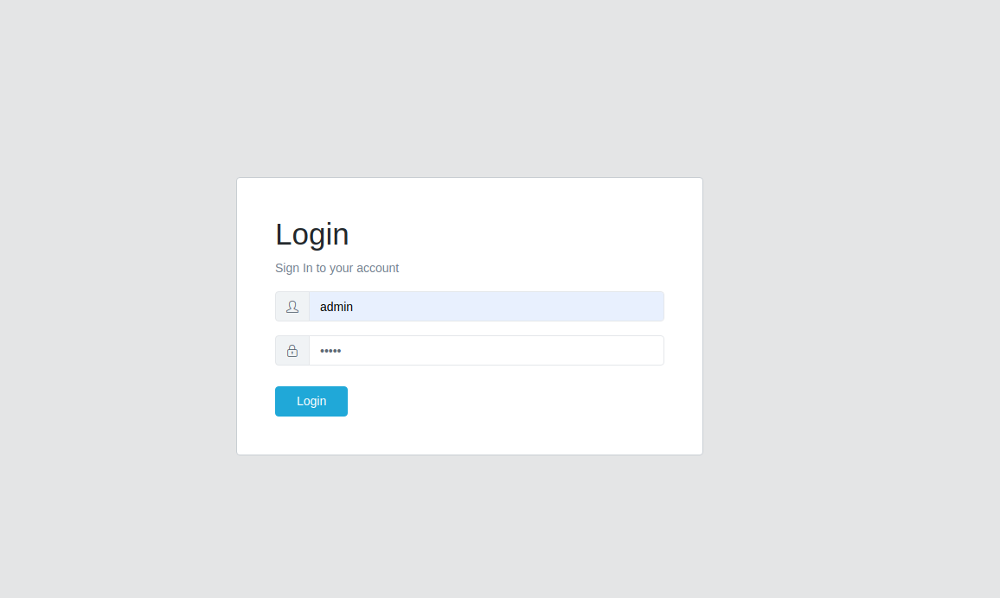
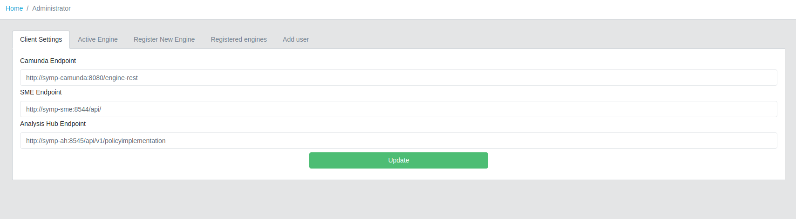
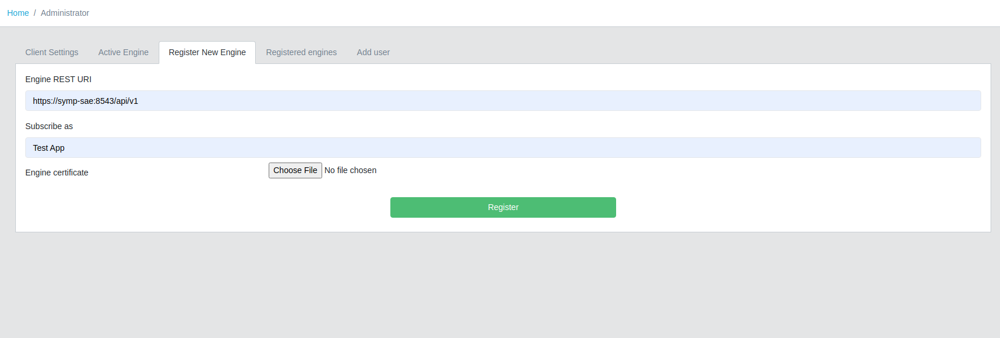
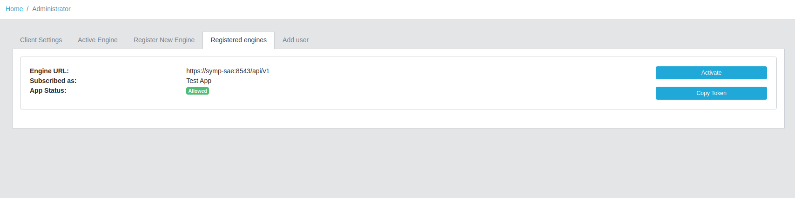

***********
SyMP Client
***********

Setting Up Endpoints and registering an Engine
==============================================

1. Login as an administrator.

.. note::
    Default credentials after initial start are:
        | **Username:** admin
        | **Password:** admin

2. Navigate to the Administrator page by clicking the button in the left sidebar.

3. In the ``Client Settings`` tab (which should be the default one loaded) configure the following:
    * **Camunda Endpoint:** http://symp-camunda:8080/engine-rest
    * **SME Endpoint:** http://symp-sme:8544/api/
    * **Analysis Hub Endpoint:** http://symp-ah:8545/api/v1/policyimplementation

4. In the ``Register New Engine`` tab configure the following:
    * **Engine REST URI:** https://symp-sae:8543/api/v1
    * **Subscribed as:** Test App (or a name by your choice)
    * **Engine Certificate:** Select the generated ``cert.crt`` file in the SyMP SAE repo folder under ``src/main/resources/ssl``

    Afterwards click on **Register** and if the registration and subscription request were successfull the app will navigate to the Dashboard page.
    Now you have to accept the subscription request on the side of the SAE. This procedure is described in the Security Analysis Engine section.

5. Select an active engine:
    To select an active engine navigate again to the Administrator page and select the ``Registered Engines`` tab. Here you will be presented with all of the registered engines and their current status.
    You can activate any of them by clicking on the **Activate** button.
    
