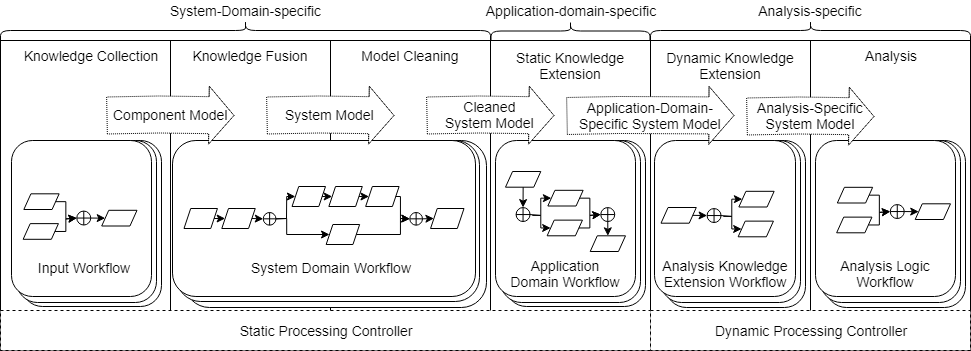

.. SyMP documentation master file, created by
   sphinx-quickstart on Tue Aug 10 11:13:59 2021.
   You can adapt this file completely to your liking, but it should at least
   contain the root `toctree` directive.

Welcome to SyMP Framework's documentation!
==========================================

This is the documentation for all of the services that compose the System Model Processing Framework.

.. toctree::
   :hidden:

   get-started/index
   client/index
   sae/index
   sme/index
   ah/index
   example/index
